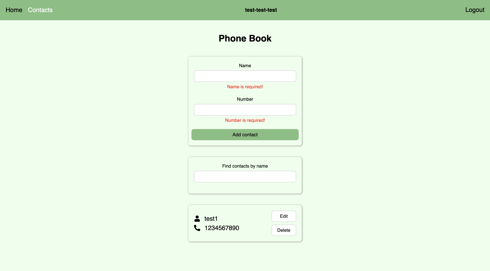

# React Auth Contacts

A contact management app with user authentication. Built with React, Redux Toolkit, and Vite.  
Deployed on [Vercel](https://react-auth-contacts.vercel.app).

## 🚀 Tech Stack

- React
- Redux Toolkit
- React Router
- Vite
- Axios
- Formik + Yup
- Styled Components

## 🔐 Features

- User registration and login
- Private and public routes
- Contact list with add, edit, delete, and search
- Form validation with inline feedback
- Toast notifications for all actions (add, edit, delete)
- Responsive design

## 🔗 Live Demo

👉 [View Live](https://react-auth-contacts.vercel.app)

---

## 🖼️ Screenshots

<table>
  <tr>
    <td align="center"> Registration Page</td>
    <td align="center"> Login Page</td>
  </tr>
  <tr>
    <td align="center"> Home Page</td>
    <td align="center"> Contacts Page</td>
  </tr>
  <tr>
    <td align="center"> Add New Contact</td>
    <td align="center"> Edit Contact</td>
  </tr>
  <tr>
    <td align="center"> Delete Confirmation</td>
    <td align="center"> Contact Deleted</td>
  </tr>
  <tr>
    <td align="center"> Search Contacts</td>
    <td align="center"> Form Validation</td>
  </tr>
</table>
